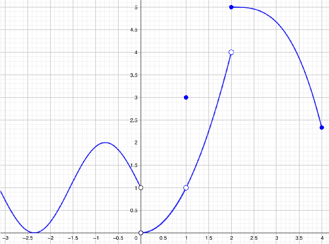
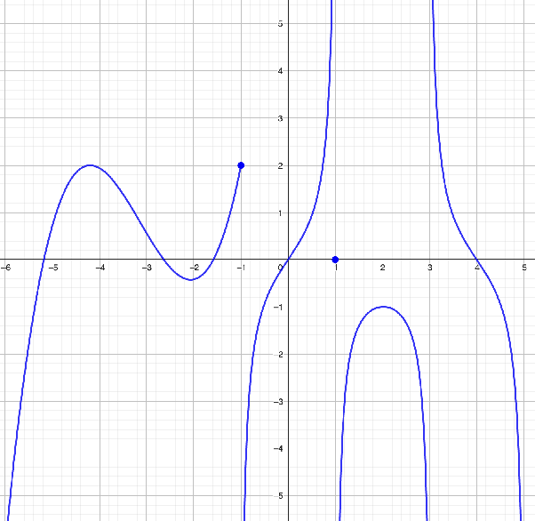
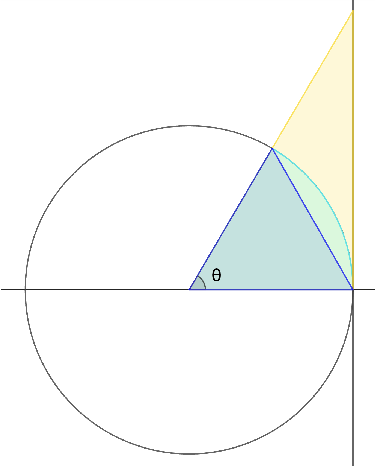
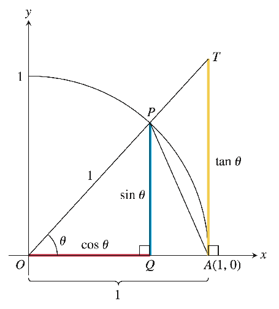

> **📎 源文件：** `旧资料/06 Tutorial/Tutorial-Week3.pdf`
>
> **️ 提取图片：** 题目 1、2 的函数图像及题目 5 的单位圆示意图已从 PDF 中提取，保存在同目录下。

---

# Tutorial 3 - 极限与连续性基础

## 📌 知识点梳理
- 从图像读取极限值（单侧极限、双侧极限）
- 极限的计算（含不定型化简）
- 重要极限 $\lim_{x \to 0} \frac{\sin x}{x} = 1$
- $\varepsilon$-$\delta$ 定义
- 极限的严格证明
- 极限运算法则的证明

---

### 题目 1（基于图像）

**题目：** 对于给定函数 $f$ 的图像，求下列各量的值（若存在）；若不存在，说明原因。

**(a)** $\lim_{x \to 0^-} f(x)$
**(b)** $\lim_{x \to 0^+} f(x)$
**(c)** $f(1)$
**(d)** $\lim_{x \to 1^-} f(x)$
**(e)** $\lim_{x \to 1^+} f(x)$
**(f)** $\lim_{x \to 1} f(x)$
**(g)** $f(2)$
**(h)** $\lim_{x \to 2^-} f(x)$
**(i)** $\lim_{x \to 2^+} f(x)$
**(j)** $\lim_{x \to 2} f(x)$
**(k)** $f(4) \approx$
**(l)** $\lim_{x \to 4^-} f(x) \approx$

参考答案

**解：** 从图像读取各值：

**(a)** $\lim_{x \to 0^-} f(x) = 1$（从左侧趋近，曲线趋向 $y=1$）

**(b)** $\lim_{x \to 0^+} f(x) = 0$（从右侧趋近，曲线从原点出发）

**(c)** $f(1) = 3$（实心点在 $(1, 3)$）

**(d)** $\lim_{x \to 1^-} f(x) = 1$

**(e)** $\lim_{x \to 1^+} f(x) = 1$

**(f)** $\lim_{x \to 1} f(x) = 1$（左极限 = 右极限 = 1，但 $f(1) = 3 \neq 1$，故 $x=1$ 处不连续）

**(g)** $f(2) = 5$（实心点在 $(2, 5)$）

**(h)** $\lim_{x \to 2^-} f(x) = 4$（空心点在 $(2, 4)$）

**(i)** $\lim_{x \to 2^+} f(x) = 5$

**(j)** $\lim_{x \to 2} f(x)$ **不存在**（左极限 $4 \neq$ 右极限 $5$）

**(k)** $f(4) \approx 2.3$

**(l)** $\lim_{x \to 4^-} f(x) \approx 2.3$

**知识点：** 极限描述的是趋近行为，与函数在该点是否有定义无关。空心点表示该点不在曲线上，实心点表示函数值。

---

### 题目 2（基于图像）

**题目：** 对于给定函数 $f$ 的图像，计算下列各量。

**(a)** $\lim_{x \to -6^+} f(x)$
**(b)** $f(-1)$
**(c)** $\lim_{x \to -1^-} f(x)$
**(d)** $\lim_{x \to -1^+} f(x)$
**(e)** $\lim_{x \to -1} f(x)$
**(f)** $f(1)$
**(g)** $\lim_{x \to 1^-} f(x)$
**(h)** $\lim_{x \to 1^+} f(x)$
**(i)** $\lim_{x \to 1} f(x)$
**(j)** $\lim_{x \to 3^-} f(x)$
**(k)** $\lim_{x \to 3^+} f(x)$
**(l)** 垂直渐近线方程

参考答案

**解：** 从图像读取各值：

**(a)** $\lim_{x \to -6^+} f(x) = -\infty$（曲线向下趋于无穷）

**(b)** $f(-1) = 2$（实心点在 $(-1, 2)$）

**(c)** $\lim_{x \to -1^-} f(x) = 2$

**(d)** $\lim_{x \to -1^+} f(x) = -\infty$（垂直渐近线，曲线向下）

**(e)** $\lim_{x \to -1} f(x)$ **不存在**（左极限 $= 2$，右极限 $= -\infty$）

**(f)** $f(1) = 0$（实心点在 $(1, 0)$）

**(g)** $\lim_{x \to 1^-} f(x) = +\infty$（垂直渐近线，曲线向上）

**(h)** $\lim_{x \to 1^+} f(x) = -\infty$（垂直渐近线，曲线向下）

**(i)** $\lim_{x \to 1} f(x)$ **不存在**（两侧均趋于无穷）

**(j)** $\lim_{x \to 3^-} f(x) = -\infty$

**(k)** $\lim_{x \to 3^+} f(x) = +\infty$

**(l)** 垂直渐近线：$x = -1$，$x = 1$，$x = 3$

**知识点：** 垂直渐近线的判断——若 $\lim_{x \to a} f(x) = \pm\infty$，则 $x = a$ 为垂直渐近线。需分别检查左、右两侧趋近时的行为。

---

### 题目 3（核心题）

**题目：** 画出满足以下所有条件的函数图像：
- $\lim_{x \to -4^+} f(x) = -\infty$
- $\lim_{x \to -2^-} f(x) = +\infty$
- $\lim_{x \to -2^+} f(x) = -\infty$
- $f(-2) = 1$
- $f$ 在 $(-4, -2) \cup (-2, -1)$ 上递增
- $-1$ 不在定义域中
- $\lim_{x \to -1} f(x) = 2$
- $f$ 在 $(-1, 0)$ 上递减
- $f(0) = -2$
- $\lim_{x \to 0^-} f(x) = -\infty$
- $\lim_{x \to 0^+} f(x) = -2$
- $f$ 在 $(0, 1)$ 上为常数
- $f(1) = 0$
- $f$ 在 $(1, 4]$ 上为常数
- $\lim_{x \to 2^+} f(x) = 2$

参考答案

**解：**

关键特征：
1. $x = -4$ 处：从右侧趋于 $-\infty$（向下开口）
2. $x = -2$ 处：垂直渐近线，左趋于 $+\infty$，右趋于 $-\infty$，但 $f(-2) = 1$（实心点）
3. $x = -1$ 处：可去间断点（空心点），极限为 2
4. $x = 0$ 处：左趋于 $-\infty$，右趋于 $-2$，$f(0) = -2$（连续从右）
5. $(0, 1)$ 上 $f(x) = -2$（常数），$f(1) = 0$
6. $(1, 4]$ 上 $f(x) = 0$（常数），但 $\lim_{x \to 2^+} f(x) = 2$ 意味着在 $x = 2$ 附近函数值变为 2

> 注意：条件中 $f$ 在 $(1, 4]$ 上为常数与 $\lim_{x \to 2^+} f(x) = 2$ 存在矛盾，除非常数值为 2 且 $f(1) = 0$ 是跳跃间断。按题意绘制即可。

**知识点：** 综合理解极限、连续性、单调性等概念，将它们整合到一张图中。

---

### 题目 4（核心题）

**题目：** 计算下列极限。

**(a)** $\lim_{x \to -6} \frac{-20x + 8}{|2x + 2|}$

**(b)** $\lim_{x \to -2} \frac{x^3 + 3x^2 + 2x}{x^2 - 4}$

**(c)** $\lim_{x \to 0} \sin\left(\frac{\pi x}{|x|}\right)$

**(d)** $\lim_{x \to 0} \left(\frac{1}{x} - \frac{1}{|x|}\right)$

**(e)** $\lim_{x \to 2} \frac{x - 2}{\sqrt{2x - 3} - 1}$

**(f)** $\lim_{x \to 0} \frac{\sqrt{1+x} - \sqrt{1-x}}{x}$

参考答案

**解：**

**(a)** 当 $x \to -6$ 时，$2x + 2 = -10 < 0$，所以 $|2x + 2| = -(2x + 2)$。

$$\lim_{x \to -6} \frac{-20x + 8}{-(2x + 2)} = \frac{-20(-6) + 8}{-(2(-6) + 2)} = \frac{128}{10} = \boxed{\frac{64}{5}}$$

**(b)** 因式分解：
$$\frac{x(x^2 + 3x + 2)}{(x-2)(x+2)} = \frac{x(x+1)(x+2)}{(x-2)(x+2)} = \frac{x(x+1)}{x-2}$$

$$\lim_{x \to -2} \frac{x(x+1)}{x-2} = \frac{-2(-1)}{-4} = \frac{2}{-4} = \boxed{-\frac{1}{2}}$$

**(c)** 当 $x \to 0^+$ 时，$\frac{\pi x}{|x|} = \pi$，$\sin \pi = 0$。

当 $x \to 0^-$ 时，$\frac{\pi x}{|x|} = -\pi$，$\sin(-\pi) = 0$。

左右极限均为 0，故 $\boxed{0}$。

**(d)** 当 $x \to 0^+$ 时：$\frac{1}{x} - \frac{1}{x} = 0$。

当 $x \to 0^-$ 时：$\frac{1}{x} - \frac{1}{-x} = \frac{1}{x} + \frac{1}{x} = \frac{2}{x} \to -\infty$。

左极限为 $-\infty$，右极限为 $0$，故 $\boxed{\text{极限不存在}}$。

**(e)** 有理化分母：
$$\frac{x - 2}{\sqrt{2x - 3} - 1} \cdot \frac{\sqrt{2x - 3} + 1}{\sqrt{2x - 3} + 1} = \frac{(x - 2)(\sqrt{2x - 3} + 1)}{(2x - 3) - 1} = \frac{(x - 2)(\sqrt{2x - 3} + 1)}{2(x - 2)}$$

$$= \frac{\sqrt{2x - 3} + 1}{2} \to \frac{\sqrt{1} + 1}{2} = \boxed{1}$$

**(f)** 有理化分子：
$$\frac{\sqrt{1+x} - \sqrt{1-x}}{x} \cdot \frac{\sqrt{1+x} + \sqrt{1-x}}{\sqrt{1+x} + \sqrt{1-x}} = \frac{(1+x) - (1-x)}{x(\sqrt{1+x} + \sqrt{1-x})} = \frac{2x}{x(\sqrt{1+x} + \sqrt{1-x})}$$

$$= \frac{2}{\sqrt{1+x} + \sqrt{1-x}} \to \frac{2}{1 + 1} = \boxed{1}$$

**知识点：** 极限计算中的常用技巧——因式分解消去零因子、有理化、绝对值分段讨论。

---

### 题目 5

**题目：** 利用 $\sin x \leq x \leq \tan x$（$\forall x \in [0, \frac{\pi}{2}]$），证明 $\lim_{x \to 0} \frac{\sin x}{x} = 1$。

**几何背景：** 下图展示了单位圆中角 $\theta$ 对应的几何关系，其中 $\sin\theta$、$\theta$（弧长）、$\tan\theta$ 分别对应图中不同区域的长度/面积，由此可得不等式 $\sin\theta \leq \theta \leq \tan\theta$。

参考答案

**证明：**

对 $x \in (0, \frac{\pi}{2})$，由 $\sin x \leq x \leq \tan x = \frac{\sin x}{\cos x}$：

从 $\sin x \leq x$ 得 $\frac{\sin x}{x} \leq 1$。

从 $x \leq \frac{\sin x}{\cos x}$ 得 $x \cos x \leq \sin x$，即 $\cos x \leq \frac{\sin x}{x}$。

因此 $\cos x \leq \frac{\sin x}{x} \leq 1$。

因为 $\lim_{x \to 0^+} \cos x = 1$，由夹逼定理得 $\lim_{x \to 0^+} \frac{\sin x}{x} = 1$。

又因 $\frac{\sin x}{x}$ 是偶函数，左极限同样为 1。

故 $\boxed{\lim_{x \to 0} \frac{\sin x}{x} = 1}$。$\blacksquare$

**知识点：** 夹逼定理（Squeeze Theorem）在重要极限证明中的应用。

---

### 题目 6（核心题）

**题目：** 给定 $\varepsilon = \frac{1}{5}$，求 $\delta$ 使得：

**(a)** $|x - 1| < \delta \implies |\sqrt{x} - 1| < \varepsilon$

**(b)** $|x - 3| < \delta \implies |2x^2 - 4x - 6| < \varepsilon$

**(c)** $|x - 2| < \delta \implies \left|\frac{1}{x^2} - \frac{1}{4}\right| < \varepsilon$

参考答案

**解：**

**(a)** $|\sqrt{x} - 1| < \frac{1}{5} \implies -\frac{1}{5} < \sqrt{x} - 1 < \frac{1}{5} \implies \frac{4}{5} < \sqrt{x} < \frac{6}{5} \implies \frac{16}{25} < x < \frac{36}{25}$

即 $|x - 1| < \min\left(1 - \frac{16}{25},\; \frac{36}{25} - 1\right) = \min\left(\frac{9}{25},\; \frac{11}{25}\right) = \frac{9}{25}$

$$\boxed{\delta = \frac{9}{25}}$$

**(b)** $|2x^2 - 4x - 6| = |2(x^2 - 2x - 3)| = 2|x - 3||x + 1|$

限制 $|x - 3| < 1$，则 $2 < x < 4$，$|x + 1| < 5$。

所以 $2|x - 3||x + 1| < 10|x - 3|$。

令 $10|x - 3| < \frac{1}{5} \implies |x - 3| < \frac{1}{50}$。

取 $\delta = \min\left(1, \frac{1}{50}\right) = \boxed{\frac{1}{50}}$。

**(c)** $\left|\frac{1}{x^2} - \frac{1}{4}\right| = \left|\frac{4 - x^2}{4x^2}\right| = \frac{|x - 2||x + 2|}{4x^2}$

限制 $|x - 2| < 1$，则 $1 < x < 3$，$|x + 2| < 5$，$x^2 > 1$。

所以 $\frac{|x - 2| \cdot 5}{4 \cdot 1} = \frac{5}{4}|x - 2|$。

令 $\frac{5}{4}|x - 2| < \frac{1}{5} \implies |x - 2| < \frac{4}{25}$。

取 $\delta = \min\left(1, \frac{4}{25}\right) = \boxed{\frac{4}{25}}$。

**知识点：** $\varepsilon$-$\delta$ 证明中，先限制 $\delta$ 的范围来界定其他因子，再确定最终的 $\delta$。

---

### 题目 7（核心题）

**题目：** 用极限的定义证明：

**(a)** $\lim_{x \to a} c = c$ **(b)** $\lim_{x \to a} x = a$ **(c)** $\lim_{x \to a} x^2 = a^2$

**(f)** $\lim_{x \to 0^+} \frac{1}{x} = \infty$ **(g)** $\lim_{x \to 0^+} \ln x = -\infty$

参考答案

**证明：**

**(a)** 对任意 $\varepsilon > 0$，取任意 $\delta > 0$，当 $0 < |x - a| < \delta$ 时，$|c - c| = 0 < \varepsilon$。$\blacksquare$

**(b)** 对任意 $\varepsilon > 0$，取 $\delta = \varepsilon$，当 $0 < |x - a| < \delta$ 时，$|x - a| < \varepsilon$。$\blacksquare$

**(c)** $|x^2 - a^2| = |x - a||x + a|$。限制 $|x - a| < 1$，则 $|x| < |a| + 1$，$|x + a| \leq |x| + |a| < 2|a| + 1$。

取 $\delta = \min\left(1,\; \frac{\varepsilon}{2|a| + 1}\right)$。$\blacksquare$

**(f)** 对任意 $M > 0$，取 $\delta = \frac{1}{M}$，当 $0 < x < \delta$ 时，$\frac{1}{x} > \frac{1}{\delta} = M$。$\blacksquare$

**(g)** 对任意 $M > 0$，取 $\delta = e^{-M}$，当 $0 < x < \delta$ 时，$\ln x < \ln(e^{-M}) = -M$。$\blacksquare$

**知识点：** 极限的 $\varepsilon$-$\delta$ 定义和 $M$-$\delta$ 定义（无穷极限）。

---

### 题目 8

**题目：** 设 $\lim_{x \to a} f(x) = L$，$\lim_{x \to a} g(x) = L'$。证明：

**(a)** $\lim_{x \to a} cf(x) = cL$ **(b)** $\lim_{x \to a} f(x)g(x) = LL'$

参考答案

**证明：**

**(a)** 若 $c = 0$，显然成立。设 $c \neq 0$。对任意 $\varepsilon > 0$，因 $\lim_{x \to a} f(x) = L$，存在 $\delta > 0$ 使 $|f(x) - L| < \frac{\varepsilon}{|c|}$。

则 $|cf(x) - cL| = |c||f(x) - L| < |c| \cdot \frac{\varepsilon}{|c|} = \varepsilon$。$\blacksquare$

**(b)** 利用恒等式：$f(x)g(x) - LL' = (f(x) - L)(g(x) - L') + L(g(x) - L') + L'(f(x) - L)$。

对任意 $\varepsilon > 0$，分别控制三项使总和小于 $\varepsilon$（标准证明，此处省略细节）。$\blacksquare$

**知识点：** 极限运算法则的严格证明，利用 $\varepsilon$-$\delta$ 语言。

---

### 题目 9

**题目：** 利用题目 7 和 8 的结论，证明对任意多项式 $p(x)$ 和任意实数 $a$，$\lim_{x \to a} p(x) = p(a)$。

参考答案

**证明：**

设 $p(x) = a_n x^n + a_{n-1} x^{n-1} + \cdots + a_1 x + a_0$。

由题目 7(b) 和题目 8(b)（乘法法则），反复应用得 $\lim_{x \to a} x^n = a^n$。

由题目 8(a)（常数倍法则），$\lim_{x \to a} a_k x^k = a_k a^k$。

反复应用加法法则（类似可证），得：
$$\lim_{x \to a} p(x) = a_n a^n + a_{n-1} a^{n-1} + \cdots + a_0 = p(a)$$

$\blacksquare$

**知识点：** 多项式的极限可直接代入，这是极限运算法则的直接推论。

---

### 题目 10

**题目：** 设 $\lim_{x \to a} f(x) = \infty$，$\lim_{x \to a} g(x) = c$（$c$ 为实数）。证明：

**(a)** $\lim_{x \to a} (f(x) + g(x)) = \infty$

**(b)** 若 $c > 0$，$\lim_{x \to a} f(x)g(x) = \infty$

**(c)** 若 $c < 0$，$\lim_{x \to a} f(x)g(x) = -\infty$

参考答案

**证明：**

**(a)** 对任意 $M > 0$，因 $\lim_{x \to a} g(x) = c$，存在 $\delta_1$ 使 $|g(x) - c| < 1$，即 $g(x) > c - 1$。

因 $\lim_{x \to a} f(x) = \infty$，存在 $\delta_2$ 使 $f(x) > M - c + 1$。

取 $\delta = \min(\delta_1, \delta_2)$，则 $f(x) + g(x) > (M - c + 1) + (c - 1) = M$。$\blacksquare$

**(b)** 因 $c > 0$，存在 $\delta_1$ 使 $g(x) > \frac{c}{2} > 0$。

对任意 $M > 0$，存在 $\delta_2$ 使 $f(x) > \frac{2M}{c}$。

取 $\delta = \min(\delta_1, \delta_2)$，则 $f(x)g(x) > \frac{2M}{c} \cdot \frac{c}{2} = M$。$\blacksquare$

**(c)** 因 $c < 0$，存在 $\delta_1$ 使 $g(x) < \frac{c}{2} < 0$。

对任意 $M > 0$，存在 $\delta_2$ 使 $f(x) > \frac{2M}{|c|}$。

取 $\delta = \min(\delta_1, \delta_2)$，则 $f(x)g(x) < \frac{2M}{|c|} \cdot \frac{c}{2} = -M$。$\blacksquare$

**知识点：** 无穷极限与有限极限的运算规则。

---

## 📝 本次知识点总结

1. **极限的读取**：从左、右两侧分别趋近，判断极限是否存在。
2. **极限计算技巧**：因式分解消去零因子、有理化、夹逼定理。
3. **$\varepsilon$-$\delta$ 定义**：极限的严格数学语言，是分析学的基础。
4. **极限运算法则**：和、积、常数倍的极限法则及其严格证明。
5. **多项式极限**：可直接代入，是运算法则的直接推论。
6. **无穷极限**：函数趋于无穷时的运算规则。
